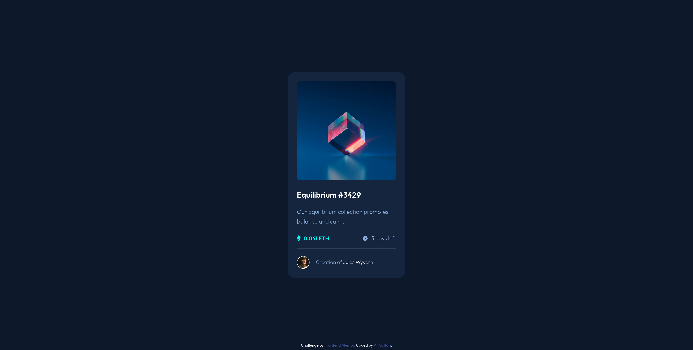

# Frontend Mentor - NFT preview card component solution

This is a solution to the [NFT preview card component challenge on Frontend Mentor](https://www.frontendmentor.io/challenges/nft-preview-card-component-SbdUL_w0U). Frontend Mentor challenges help you improve your coding skills by building realistic projects. 

## Table of contents

- [Frontend Mentor - NFT preview card component solution](#frontend-mentor---nft-preview-card-component-solution)
  - [Table of contents](#table-of-contents)
  - [Overview](#overview)
    - [The challenge](#the-challenge)
    - [Screenshot](#screenshot)
    - [Links](#links)
  - [My process](#my-process)
    - [Built with](#built-with)
    - [What I learned](#what-i-learned)
  - [Author](#author)

**Note: Delete this note and update the table of contents based on what sections you keep.**

## Overview

### The challenge

Users should be able to:

- View the optimal layout depending on their device's screen size
- See hover states for interactive elements

### Screenshot



### Links

- Solution URL: [Solution](https://www.frontendmentor.io/solutions/nft-preview-card-component-solution-GLdiJkSHwf)
- Live Site URL: [Live site](https://nft-preview-card-component-eight-amber.vercel.app/)

## My process

### Built with

- Semantic HTML5 markup
- CSS custom properties
- Flexbox

### What I learned

I learned how to add hover effect with multi layers to an element with html and css.

here is my solution:

```html
<div class="card_header">
  
  <div class="overlay"></div>
  
</div>
```
```css
.card_header {
    position: relative;
    width: 100%;
}

.card_header:hover > *{
    opacity: 1;
    transition: all 0.5s ease-in-out;
    cursor: pointer;
}

.overlay {
    position: absolute;
    top: 0;
    right: 0;
    bottom: 0;
    left: 0;
    background-color: hsl(178, 100%, 50%,0.5);
    width: 275px;
    height: 275px;
    border-radius: 10px;
    opacity: 0;
    transition: opacity 0.2s linear;
}

.view-icon {
    position: absolute;
    top: 41%;
    right: 41%;
    bottom: auto;
    left: auto;
    opacity: 0;
    transition: opacity 0.2s linear;
}
```

## Author

- Website - [Ali Saffari](https://github.com/alivsaffari)
- Frontend Mentor - [@alivsaffari](https://www.frontendmentor.io/profile/alivsaffari)
- Twitter - [@alivsaffari](https://www.twitter.com/alivsaffari)